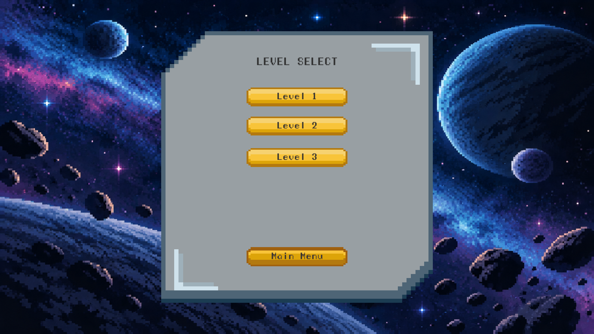
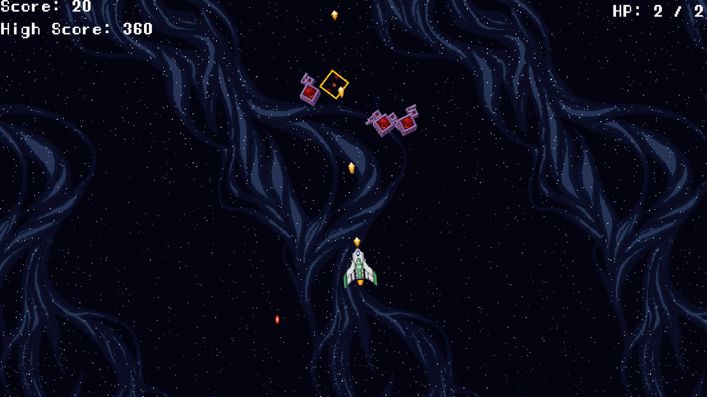

# Outer Rift

Outer Rift is a 2D pixel-art space shooter built using Unity and C# as part of my game design course.

## Features

- 3 playable levels
- Multiple enemy types
- Player shooting system
- Kamikaze enemy with chasing and explosion behavior
- Player health system
- Health pickup
- Score and high score system
- Level selection
- Instructions screen
- Pause menu
- Pixel-art visuals

## Technologies

- Unity 2022.3.26f2
- C#
- TextMeshPro

## Screenshots

### Main Menu

### Level Select

### Gameplay

## Project

This project was created as part of a 2D game design and development course, with additional gameplay and visual modifications made to the original project.
